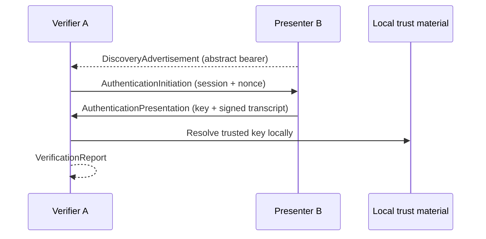

# Robot Identity Framework

Experimental, transport-independent authentication for robots and other Physical AI endpoints.

This public repository contains an open specification draft and a minimal TypeScript reference SDK. The SDK proves that the same authentication transcript can be carried by an in-memory link today and by BLE, local Wi-Fi, UWB-assisted, vehicle, or other bearer profiles later.

> **Alpha warning:** this project has not received an independent security review. It is not a production security claim, certification program, safety controller, or interoperability standard.

## What this project does

- discovers an authentication-capable endpoint through an abstract bearer;
- creates a fresh challenge and session transcript;
- proves possession of an identity key;
- binds the proof to the advertisement and session;
- verifies the proof against locally supplied trust material;
- returns `verified`, `failed`, or `unresolved` evidence.

It deliberately does **not** authorize actions, issue robot commands, decide safety, define industry-specific attributes, or require a global registry or hosted service.

The SDK is used on **both sides** of an exchange. Presenter endpoints use its discovery and signing functions; verifier endpoints use its challenge, trust, replay, verification, and report functions. The same package exposes both role surfaces in this alpha. An independently implemented verifier is possible only if it follows the wire model and passes compatibility tests.



## Repository contents

- `spec/`: experimental protocol specification;
- `src/`: transport-independent TypeScript reference SDK;
- `test/`: positive, tampering, expiry, unknown-trust, and replay tests;
- `examples/`: a two-endpoint offline example;
- `docs/licensing.md`: plain-language rights summary.

Multiple presenters may advertise at once. A verifier keeps them as separate untrusted candidates, selects one advertisement, and creates an isolated authentication session for that target. Authentication proves the selected communication endpoint; physical-body selection remains a separate binding problem.

## Try it locally

Requirements: Node.js 22 or later.

```bash
npm install
npm test
npm run example
```

The current alpha uses JSON and Ed25519 to exercise the data model. Those choices are an implementation profile, not a final wire-format commitment. BLE pairing is not required and BLE identity is not treated as robot identity.

## Implementation status

| Capability | Status |
| --- | --- |
| One-way proof of key possession | Implemented |
| Local trusted-key verification | Implemented |
| Advertisement/session binding | Implemented |
| Expiry and in-memory replay guard | Implemented |
| Arbitrary attribute envelope model | Model only; issuer proof verification pending |
| Mutual authentication | Specification direction; implementation pending |
| BLE, Wi-Fi, UWB, and vehicle adapters | Interfaces/profiles pending |
| Physical-entity binding | Report vocabulary only |

## License and rights

The specification, SDK source, examples, and tests are licensed under the [Apache License 2.0](LICENSE). In summary, commercial use, modification, redistribution, private use, and patent use are permitted subject to the license conditions. Preserve the license and notices, and state significant changes when redistributing modified work.

The license provides no warranty, liability commitment, certification, endorsement, or trademark permission. See [Licensing and rights](docs/licensing.md) and [Trademarks](TRADEMARKS.md). This summary is informational; the license text controls.

## Contributing and security

Contributions are welcome under the same Apache-2.0 license and use Developer Certificate of Origin sign-off. See [CONTRIBUTING.md](CONTRIBUTING.md).

Please do not file public issues for suspected vulnerabilities. Follow [SECURITY.md](SECURITY.md).
